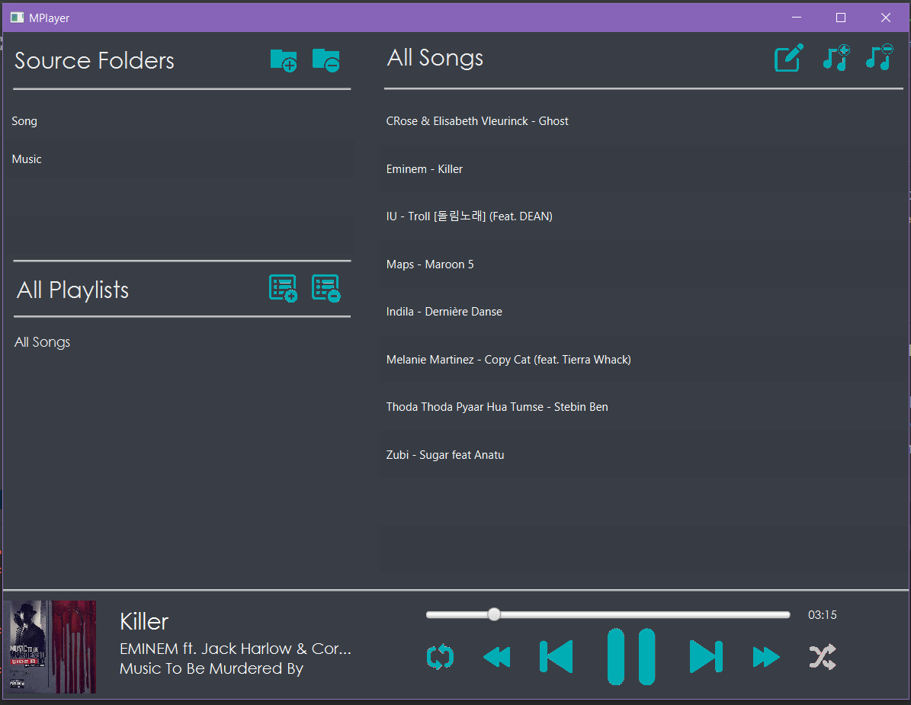

# Mplayer

This is a dark themed Java Fx music player which can play all the songs from your computer and provides other control and feature.

## Features

* Allows user to select multiple folder to use as source for song.
* User can create custom playlist, add and delete playlist
* Allows user to control and play songs.
* It also displays basic song details for the current playing song.

## Screenshots

